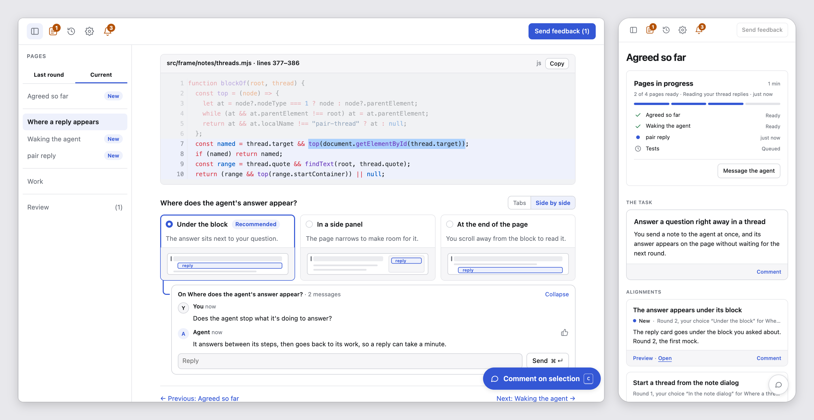

<h1>
<picture>
  <source media="(prefers-color-scheme: dark)" srcset="assets/logo-dark.svg">
  
</picture>
</h1>

## Pair programming, now that your agent writes the code.

In pair programming, one person drives and the other navigates. Your agent
drives now, so `pair` puts you in the navigator's seat. You decide what
matters, question what doesn't add up, and send the agent back when it's off
course. You finish with a plan you trust and a solution you understand.

**It runs on your machine, inside the agent CLI you already use.**

<picture>
  <source media="(prefers-color-scheme: dark)" srcset="assets/pair-dark.png">
  
</picture>

## Get started

`pair` needs Node 20.1.0 or newer.

```sh
npm install -g @ryansaxe/pair             # the application and the pair command
npx skills add RyanSaxe/pair -g           # the skill your agent CLI loads
```

Then, in your project, invoke the `pair` skill with what you want to work on:

> plan retrying a charge when the payment gateway times out

> help me understand how this service handles retries

The agent opens the session in your browser, or gives you its link when a
pair tab is already open.
[Sessions and rounds](docs/concepts/sessions-and-rounds.md) explains what
happens there, and [Install](docs/getting-started/install.md) says what each
agent CLI needs first.

## How it works

<picture>
  <source media="(prefers-color-scheme: dark)" srcset="docs/assets/session-dark.svg">
  
</picture>

A session is a series of rounds. In each round the agent publishes pages and
you respond: choose, comment, send feedback, or start a thread for an answer
right away. The agent records the work it thinks is worth doing as
proposals, and changes your project only when you start one or tell it to.
Work you start runs in the same session, or in a sub-session you can move
to and from, and a session runs until you close it.

<picture>
  <source media="(prefers-color-scheme: dark)" srcset="docs/assets/architecture-dark.svg">
  
</picture>

Your agent runs `pair` commands in its own shell. The `pair` hub, on your
machine, serves the pages to your browser and wakes the agent when you
respond. [Concepts](docs/concepts/) explains each part in more depth.

## Documentation

- [Getting started](docs/getting-started/) installs `pair` and runs a first
  session.
- [Concepts](docs/concepts/) explains sessions, rounds, pages, Agreed,
  proposals and the hub.
- [Guides](docs/guides/) covers planning, understanding code and building
  the work.
- [Reference](docs/reference/) lists every command and setting, and what the
  agent reads.
- [Troubleshooting](docs/troubleshooting.md) covers the problems people hit.

To change `pair`, start at [Contributing](docs/contributing/README.md).
[BACKLOG.md](BACKLOG.md) lists work planned but not started.

## License

[MIT](LICENSE)
