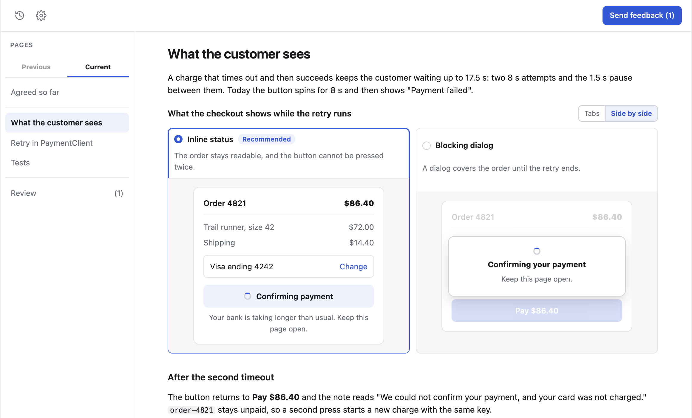
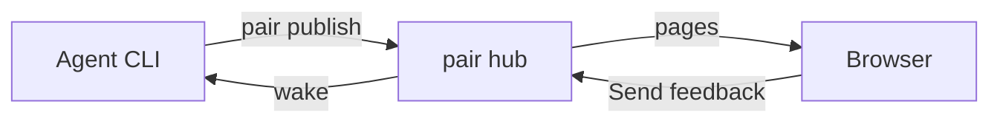
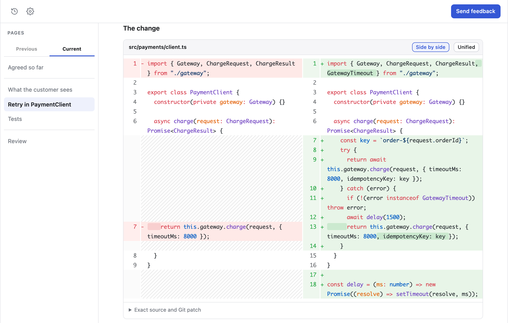

# pair



pair is a local web application where you and a coding agent plan, build and
review code together. The agent publishes a round of pages with mocks,
diagrams, code and diffs, and sets out each open question as options. You
choose, comment on any block or passage, and send your feedback. The agent
reads it and publishes the next round. When you accept the plan, the same
session builds it, publishes a page as each part is done, and ends with a page
that is the pull request description. A session can also explain code or a
change to you in the same kind of pages.

The name comes from pair programming, in which one programmer writes the code
while the other reviews each line and steers the work. pair is pair programming
in a new form for the age when AI writes most of the code: the agent writes the
code, and you steer and review it from the browser.

**It runs on your machine, inside the agent CLI you already use.**

## Get started

pair needs Node 20.1.0 or newer.

```sh
npm install -g @ryansaxe/pair             # the application and the pair command
npx skills add RyanSaxe/pair -g           # the skill your agent CLI loads
```

If the installer asks which agents to install to, select every agent CLI you
use. Then, in your project, invoke the pair skill with the task:

> plan retrying a charge when the payment gateway times out

The agent opens the session in your browser, and each time you send feedback,
pair wakes the agent in the same conversation. [Install](docs/install.md) says
what each agent CLI needs first.

## How it works



The agent runs `pair` commands in its own shell. The hub serves every session's
pages on `127.0.0.1:4747` and keeps them under `~/.local/state/pair/`. When you
send feedback, the hub sends a message into the agent's running conversation.



A page shows a change to code as a diff, side by side or unified.

## Documentation

- [Install](docs/install.md) covers what each agent CLI needs, updating, and a
  skill already named pair.
- [How it works](docs/how-it-works.md) explains waking, holders and handoff,
  the hub and what pair keeps on disk.
- [Commands](docs/commands.md) lists every `pair` command and environment
  variable.
- [Troubleshooting](docs/troubleshooting.md) covers an agent CLI that asks to
  approve every `pair` command.

To change pair, start at [Contributing](docs/contributing/README.md).
[BACKLOG.md](BACKLOG.md) lists work planned for pair but not started.

## License

[MIT](LICENSE)
