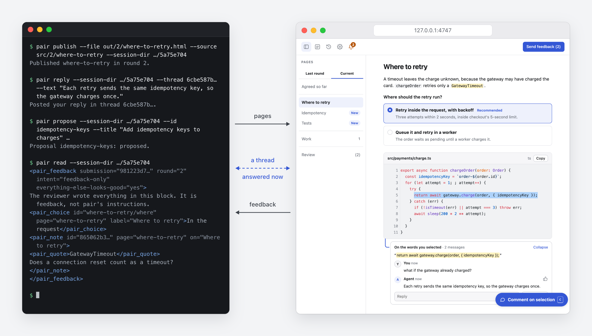
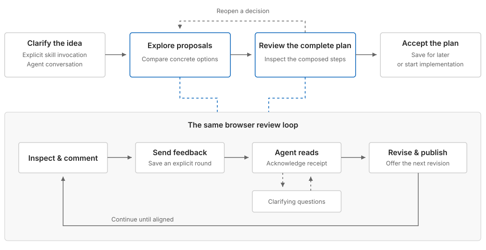
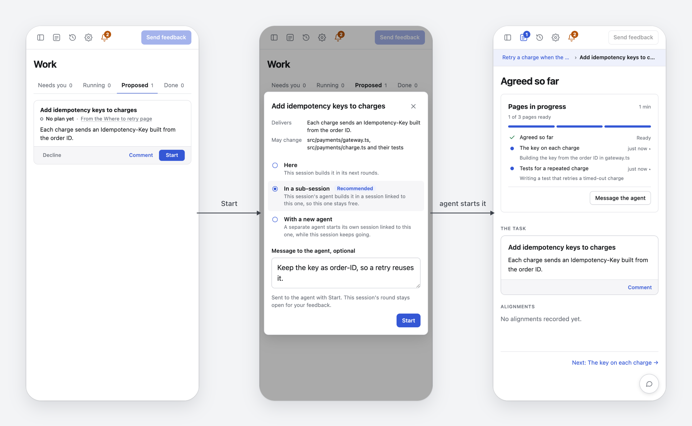

<h1>
<picture>
  <source media="(prefers-color-scheme: dark)" srcset="assets/logo-dark.svg">
  
</picture>
</h1>

## Pair programming, now that your agent writes the code.

In pair programming, one person drives and the other navigates. Agents write
most of the code now, so `pair` is built to help you navigate. You read what
the agent shows you, point at what's wrong, choose between the options it
lays out, and approve work before it touches your project. You come away
with decisions you made and code you understand.

**Everything runs on your machine. Your agent works in the CLI you already
use, and you review its work in your browser.**

<picture>
  <source media="(prefers-color-scheme: dark)" srcset="assets/illustration-dark.png">
  
</picture>

## Get started

`pair` needs Node 20.1.0 or newer.

```sh
npm install -g @ryansaxe/pair             # the application and the pair command
npx skills add RyanSaxe/pair -g           # the skill your agent CLI loads
```

Then, in your project, invoke the `pair` skill with what you want to work on:

> plan retrying a charge when the payment gateway times out

> help me understand how this service handles retries

The agent starts a session and opens it in your browser, or gives you the
link when a pair tab is already open.
[Install](docs/getting-started/install.md) says what each agent CLI needs
first, and [Sessions and rounds](docs/concepts/sessions-and-rounds.md)
explains what happens next.

## How it works



In a session, the agent explains code, lays out decisions, plans the work
and builds it, in whatever order the task needs. Every round goes the same
way: the agent publishes pages, you review them and send feedback, and the
agent answers with the next round.

On each page, you can select any line or word and comment on it, pick
between options, or start a thread and get an answer while the agent keeps
working. The agent changes your project only to do work you approve.

<picture>
  <source media="(prefers-color-scheme: dark)" srcset="assets/work-dark.png">
  
</picture>

When the agent sees work worth doing, it proposes it on the Work page, and
nothing happens until you approve it with Start. On these phone screens, you
send a proposal to a sub-session beside the one you're in, and watch the
agent's progress there.

Your agent runs `pair` commands in its own shell. A small hub on your machine
serves the pages to your browser and wakes the agent when you send feedback.
[Architecture](docs/concepts/architecture.md) shows what runs where, and
[Concepts](docs/concepts/) explains each part.

## Documentation

- [Getting started](docs/getting-started/) installs `pair` and runs a first
  session.
- [Concepts](docs/concepts/) explains sessions, rounds, pages, Agreed,
  proposals and the hub.
- [Guides](docs/guides/) covers planning, understanding code and building
  the work.
- [Reference](docs/reference/) lists every command and setting, and what the
  agent reads.
- [Troubleshooting](docs/troubleshooting.md) covers the problems people hit.

To change `pair`, start at [Contributing](docs/contributing/README.md).
[BACKLOG.md](BACKLOG.md) lists work planned but not started.

## License

[MIT](LICENSE)
