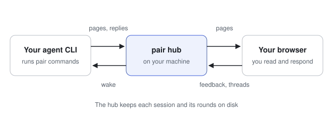

# Architecture

<picture>
  <source media="(prefers-color-scheme: dark)" srcset="../assets/architecture-dark.svg">
  
</picture>

Your agent runs `pair` commands in its own shell. Each session command sends
a request to the **hub**, one process on your machine that serves every live
session to your browser and wakes the agent when you respond.

## The hub

### When the hub runs

- A session command, such as `pair start`, starts the hub when none is
  running.
- A session is live from `pair start` until you close it or its agent
  pauses it. The hub exits once no session has been live for
  `PAIR_HUB_IDLE_SECONDS`, and the next `pair start` starts a new hub on the
  same port.
- A new hub loads every session from disk, so each session keeps its URL.
- When `pair start` finds a hub that runs a different version of pair while
  a session is live, it uses that hub and prints a warning. The next
  `pair start` that finds no live session stops the old hub and starts one
  that runs its own version.

### The hub and your browser

- Every pair tab asks the hub for the session list every 5 seconds, with
  each session's latest events for the bell.
- The hub records when a pair tab on this machine last asked for the session
  list. When the agent publishes the first Agreed of a new session,
  `pair publish` prints an instruction to open the URL in your browser if no
  tab asked in the last 90 seconds, and otherwise to give you the link in
  chat.
- The hub redirects the root URL, `http://127.0.0.1:4747/` by default, to
  the session that has waited longest for your review, or else to the
  session you opened last. You can bookmark it.

## When the hub wakes the agent

The hub wakes the holder at these moments:

- When you send feedback, unless the session is paused.
- When you send a message in a [thread](threads.md), even while the session
  is paused. The wake message contains your message, or its first 500
  characters cut at a space when it is longer, the number of images you
  attached, and the `pair read --thread` command that prints the whole
  thread with the images' paths.
- When you start a [proposal](proposals-and-work.md) here or in a
  sub-session, unless the session is paused. The wake message contains the
  message you sent with Start.
- When another agent starts a proposal on your words with
  `pair propose --start`, here or in a sub-session, unless the session is
  paused. When the holder runs that command itself, `pair propose` prints
  `pair read` as its next step, so the hub sends no wake.
- When you press Open a new agent session, which starts a thread on the
  card.

The hub sends no wake when you decline a proposal, give a reply a thumbs
up, or close a linked session. The holder's next `pair read` prints the
proposals you declined and the linked sessions you closed.

## How the hub wakes each agent CLI

`pair start` records how to wake the agent that ran it. When it finds no way
to wake the agent, it refuses and prints what to do.

| Agent CLI   | What `pair start` records                                              | How the hub wakes the agent                                                                                                      |
| ----------- | ---------------------------------------------------------------------- | -------------------------------------------------------------------------------------------------------------------------------- |
| Claude Code | `CLAUDE_CODE_MESSAGING_SOCKET` and `CLAUDE_CODE_MESSAGING_TOKEN`       | It sends a message over the inbox socket.                                                                                        |
| Codex       | `CODEX_THREAD_ID`, and the socket of Codex's app-server daemon         | It sends `turn/steer` over the daemon's socket into the turn in progress, or else runs `codex queue --thread ID --message TEXT`. |
| Copilot CLI | `COPILOT_AGENT_SESSION_ID` and the port Copilot listens on             | It sends the message through the SDK inside Copilot CLI with mode `immediate`, or with `enqueue` when Copilot refuses that.      |
| pi          | `PAIR_PI_SOCKET` and `PAIR_PI_SESSION`, from pair's extension          | It sends a JSON line over the extension's socket, and the extension gives pi the message as a steering message.                  |
| opencode    | `PAIR_OPENCODE_SOCKET` and `PAIR_OPENCODE_SESSION`, from pair's plugin | It sends a JSON line over the plugin's socket, and the plugin sends the message at once with `promptAsync`.                      |

Most agent CLIs read a wake message in the middle of a turn. A Codex whose
daemon does not run the thread, and a Copilot CLI that refuses `immediate`,
read it when the turn ends.
[Adapters](../contributing/adapters.md#when-the-cli-reads-the-line) has a
table of when each one reads it.

### Codex

A plain `codex` from version 0.160 runs each of its conversations, which
Codex calls threads, on a shared app-server daemon. The daemon listens on
`app-server-control/app-server-control.sock` under `CODEX_HOME`, or under
`~/.codex`.

- When a turn of the agent's thread is in progress, the hub connects to that
  socket and sends the line with `turn/steer`, and Codex reads it between
  the steps of the turn.
- In every other case the hub runs `codex queue`. When Codex is idle, it
  then starts a turn with the line at once. When the daemon does not run
  the thread, as with a Codex older than 0.160, Codex reads the line when
  its turn ends.

Codex asks you to approve each command its sandbox blocks, every `pair`
command included, unless an allow rule names the command. `pair start`
refuses under Codex until `~/.codex/rules/pair.rules` exists, and
`pair setup-codex` writes that file.

### Copilot CLI

Copilot CLI only takes messages from the hub when you start it with
`--ui-server`. Without that flag, `pair start` refuses and prints
`copilot --ui-server --resume <session id>`.

### pi and opencode

The hub can only send a message to pi through pair's extension, and to
opencode through pair's plugin. You register each one once. When pi runs
without the extension, or opencode without the plugin, `pair start` refuses
and prints the `pi install` command, or the plugin's path and the opencode
config file to add it to.

The hub records a wake as sent, with `wake.last.ok` set to `true`, once the
extension or the plugin answers that it has taken the message, which
happens before the agent reads it.

When pi or opencode has exited, the wake fails with
`the agent CLI has exited (ENOENT …)` after a clean exit, or with
`(ECONNREFUSED …)` after the CLI was killed.

## The result of a wake

`pair status` shows the holder and the result of the hub's last wake for
your feedback or a Start.

- The result of each wake has `via`, the path the message took, such as
  `steer` or `queue` for Codex.
- Each wake also sets `holder.steerable` in `status.json`, which is `true`
  when the agent CLI reads a message in the middle of a turn.
- When a wake fails, the progress card shows "Could not wake the agent.
  Send a message in chat." and the [handoff line](holders-and-handoff.md).

## Storage

pair keeps everything under `$XDG_STATE_HOME/pair/`, or
`~/.local/state/pair/`.

```text
hub/
  hub.json           pid, port, hosts, code version, registration secret
  hub.log
sessions/<dir>/      the directory name is not the session ID
  status.json        title, stage, holder, last wake, open round, linked parent; pair status prints it
  connection.json    session ID, hub origin, agent token, the agent CLI's name
  wake.json          how to wake the holder, such as its inbox socket or thread ID
  pages/<round>/     published page records
  src/<round>/<id>/  each page's source
  rounds/            built rounds
  feedback/          your submissions
  uploads/           images on your comments: PNG, JPEG, GIF or WebP, up to 10 MB
  scenes/            editable shapes of drawing answers
  threads/           one file per thread
  proposals/         one file per proposal
  activity.json      the last 50 events, for the bell
  output/            command output too long to print
```

The git worktrees where the agent tries ideas are inside the session's
directory too. The hub deletes nothing when a session closes, and the agent
asks you before it deletes a worktree it made.

Sessions from interactive-plan, the tool that came before `pair`, stay under
`~/.local/state/interactive-plan/`. `pair` does not open them, so start a
new session instead.
