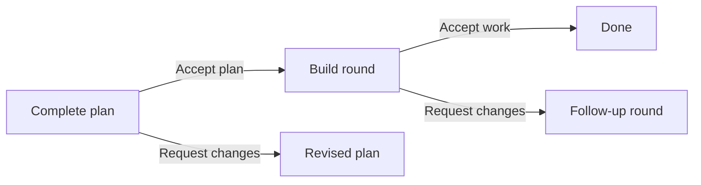

# Offers and building

Most rounds only take feedback. A round with an **offer** can also be
accepted: a complete plan, or work the agent built. Its header button reads
**Finish review** instead of **Send feedback**.

**Request changes** needs a comment, and the agent publishes a new round.
Anything you drafted goes with whichever you choose.

## Accept plan

The agent offers a plan only when nothing is left to decide. It opens on an
overview, and shows every mock, wording and interface you approved.

| Action               | What happens                                                                                            |
| -------------------- | ------------------------------------------------------------------------------------------------------- |
| Start implementation | The agent builds the plan now, in this session. Optional guidance goes with it.                         |
| Save for later       | The agent stops. Give the page's [handoff line](holders-and-handoff.md) to any agent to build it later. |

An accepted plan never changes. A change needs a new round and a new review.

## The build round

- One page per part of the plan, published as each part is done and
  checked. The last page is the pull request description.
- Each page says what was built and any departure from the plan, with the
  reason. The agent decides rather than stopping to ask.
- To ask about the build or redirect it, start a
  [thread](threads-and-side-work.md).

## Accept work

| Action              | What happens                                                                                   |
| ------------------- | ---------------------------------------------------------------------------------------------- |
| Open a PR           | The agent opens the pull request with the last page as its body, and fixes CI until it passes. |
| Finish without a PR | The work stays committed on its branch.                                                        |

Either way, the session is then complete.
