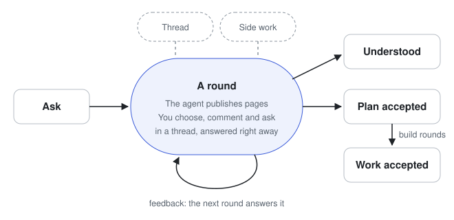
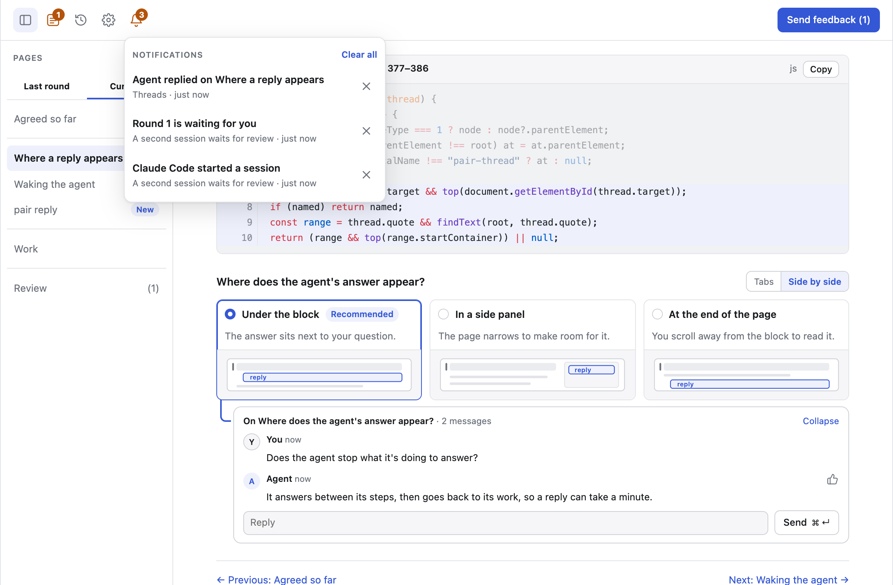

# Sessions and rounds

A session is one piece of work you do with your agent: planning a change,
building it, or understanding something. It lives at one URL, and each round
appears in the same tab.

<picture>
  <source media="(prefers-color-scheme: dark)" srcset="../assets/session-dark.svg">
  
</picture>

## A round

1. The agent publishes **Agreed** and the names of the round's pages, then
   each page as it finishes. You can start reading straight away.
2. You respond on the pages: choose, answer, comment.
3. You press **Send feedback**. The agent reads it and publishes the next
   round.

While the agent works, a card at the top of Agreed shows what it is doing
and how many pages are ready.

## The sidebar

The sidebar lists the round's pages, then **Review**. The first button in
the header opens and closes it, and the frame keeps your choice in this
browser. At 720px and below the sidebar starts closed and opens over the
page, and choosing a page closes it.

## What you can do on a page

| To                        | Do this                                                                 |
| ------------------------- | ----------------------------------------------------------------------- |
| Choose between options    | Press an option. **Recommended** is only a suggestion until you choose. |
| Answer a question         | Type in its box, or draw when it asks for a drawing.                    |
| Comment on anything       | Select text or a block, then press <kbd>c</kbd>.                        |
| Get an answer now         | Send the comment as a [thread](threads-and-side-work.md).               |
| Review what you will send | Press <kbd>r</kbd>.                                                     |

## Agreed

Agreed is the first page of every round. It holds the **task**, what the
session is working towards, and every decision settled so far, each with a
link to where it was agreed. Comment on anything there that is wrong.

| Tag               | Meaning                             |
| ----------------- | ----------------------------------- |
| New, Updated      | Changed in this round.              |
| Revisiting        | Your feedback reopened it.          |
| No longer applies | Folded at the end, with the reason. |

## Sessions and notifications

The Sessions button, second in the header, or <kbd>g</kbd>, opens the session
list: every live session in the order it started, with **Copy handoff line**
and ✕ to close one for good.

- The button's number counts the live sessions. It is orange when another
  session waits for you or its agent could not be woken, blue when another
  session has pages you have not opened, and grey otherwise.
- <kbd>1</kbd>–<kbd>9</kbd> open a session by its number, and <kbd>w</kbd> opens the next one
  waiting for you.
- **New** marks each page of a round that you have not opened.
- A session is listed from the moment it starts. Until the agent publishes
  its first Agreed, the session's page shows its title, its agent and the
  progress card.

The bell, or <kbd>n</kbd>, lists agent replies and side-work pull requests from
every session, and each other session that starts or has a round waiting for
you. A line leaves when you click it or its ✕, a waiting round's line leaves
once you send that round, and a reply in a thread clears that thread's lines.
**Clear all** empties the list. The bell's orange number is the number of
lines. With notifications on in Settings, you also get a system notification
for each new line and when an agent cannot be woken, unless its session is
open in the tab you are using.

<picture>
  <source media="(prefers-color-scheme: dark)" srcset="../assets/bell-dark.png">
  
</picture>

## Feedback

- Everything you do is a draft in your browser until you send it.
- **Everything else looks good**, on by default, agrees with whatever the
  pages proposed that no comment of yours challenges. It never answers a
  choice for you.
- Feedback never lets the agent build. Only
  [accepting a plan](offers-and-building.md) does.
