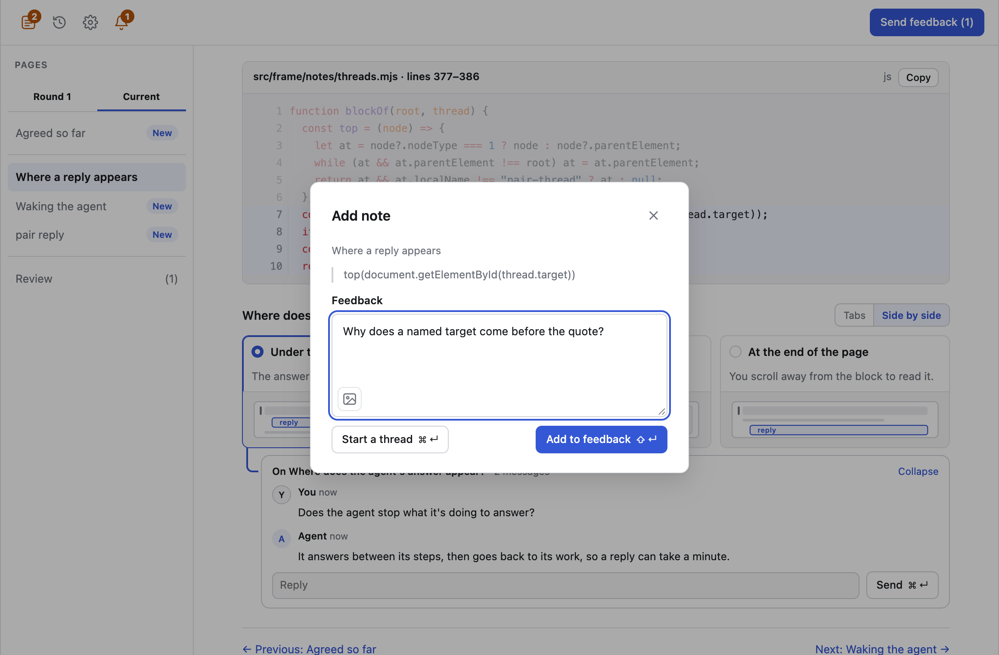

# Threads and side work

A **thread** gets you an answer now, without waiting for the next round.
**Side work** is work that turned up in a session but is not its task.

## Threads

Write a comment, then press **Start a thread** (<kbd>⌘</kbd>
<kbd>Enter</kbd>, or <kbd>Ctrl</kbd> <kbd>Enter</kbd> off a Mac) instead of
**Add to feedback**. The comment goes to the agent at once, and its reply
appears in a card under the block or the side-work item you commented on.

<picture>
  <source media="(prefers-color-scheme: dark)" srcset="../assets/note-dialog-dark.png">
  
</picture>

The first line of a card shows what the thread is on. For a comment on a
block, it shows the block's name. For words you selected, it shows the table
row, line of code, option or checklist item that contains them, and the card
quotes the words. When a block has four or more threads, the frame collapses
all but the two newest, and a card you expand or collapse stays that way.

- The agent answers between its steps, whatever it is doing, so a reply can
  take a minute.
- A reply can hold text, code, diffs and diagrams. Anything bigger, or
  anything you need to decide, comes as a page in the next round.
- A thread does not change the round's pages, but it can settle a decision,
  which Agreed then credits to the thread.

The line under your message says where the thread is:

| Line                      | Meaning                                                            |
| ------------------------- | ------------------------------------------------------------------ |
| Sent to the agent         | The agent has been woken to read it.                               |
| Read · replying           | The agent is writing its reply.                                    |
| Could not reach the agent | Another agent can [take the session over](holders-and-handoff.md). |

## Side work

When something outside the task turns up, the agent records it instead of
adding it to the task. You can also ask for side work in a comment. The frame
lists each item in Agreed's Side work tab.

| Button  | What it does                                                                                                                                                                                                                       |
| ------- | ---------------------------------------------------------------------------------------------------------------------------------------------------------------------------------------------------------------------------------- |
| Start   | Opens a popup with an optional message to the agent. **Start in parallel** has the agent do the work now, on its own branch, ending in a pull request. **Copy prompt** copies a prompt that plans the item in a new agent session. |
| Drop    | Sets the item aside. Not offered once the item is Done or Moved.                                                                                                                                                                   |
| Comment | Adds a comment on the item to your feedback.                                                                                                                                                                                       |

An item moves through **Recorded → Started → Working → Pull request → Done**,
and Agreed shows each change as it happens. An item you plan in a new session
goes from **Recorded** to **Moved** once that session starts, with a link to
it. Done, dropped and moved items fold under **Finished**.
