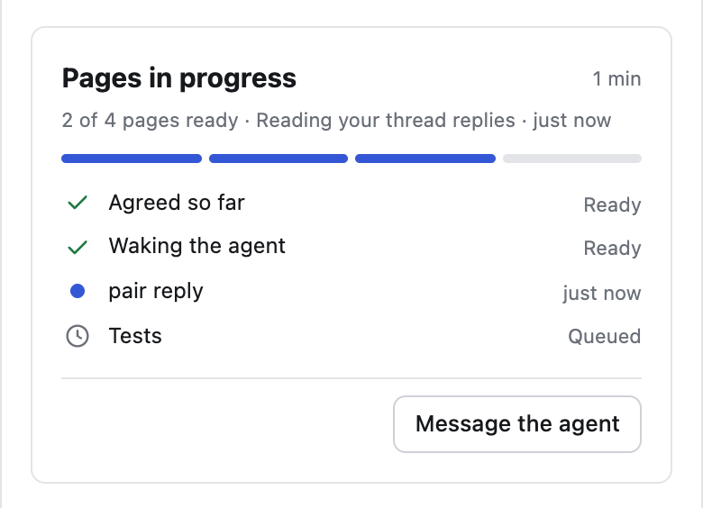

# Build a plan

After you accept a plan with **Start implementation**, the agent builds it
in the same session and tab. The build is a round of its own, with a page
for each part of the work.

## Follow the build

<picture>
  <source media="(prefers-color-scheme: dark)" srcset="../assets/progress-card-dark.png">
  
</picture>

- The build round's Agreed shows the task and a progress card: each page as
  Ready, Working or Queued, and the agent's latest note.
- Each page is published once its part is done and checked, so you can read
  it while the next part is built.
- A page shows what was built, and any departure from the plan with the
  reason. The agent decides rather than stopping to ask.
- The plan stays in its own round. Open it from the Rounds button, the clock
  in the header.

## Steer it

| To                            | Do this                                                        |
| ----------------------------- | -------------------------------------------------------------- |
| Change the work while it runs | Start a thread on the page. The reply says what will change.   |
| Stop                          | Tell the agent in chat. It pauses, and continues when you ask. |

## Review the work

The last page is the pull request description: what the work is, why, how to
review it and what was done to trust it. Press **Finish review**:

- **Request changes**: the agent changes the work and publishes a follow-up
  round.
- **Accept work** with **Open a PR**: the agent opens the pull request with
  that page as its body and fixes CI until it passes.
- **Accept work** with **Finish without a PR**: the work stays on its branch.

A plan saved for later is built the same way, by whichever agent runs its
[handoff line](../concepts/holders-and-handoff.md).
