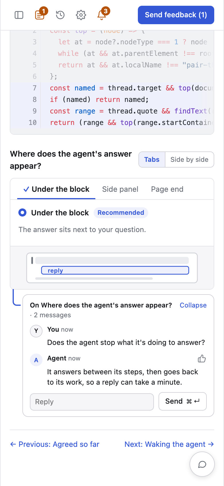

# Plan a change

Planning ends with a plan that someone who saw none of the rounds could
build, attached to the [proposal](../concepts/proposals-and-work.md) for the
work. Use it for any change where how to build it is not obvious yet.

## Ask

```text
/pair plan retrying a charge when the payment gateway times out
```

Say what the agent cannot learn from the code: why the change is needed,
and anything you already know you do or do not want.

## Each round

<picture>
  <source media="(prefers-color-scheme: dark)" srcset="../assets/plan-phone-dark.png">
  
</picture>

- **Read the task first.** It is at the top of Agreed. Everything else
  depends on it, so correct it as soon as it is wrong.
- **Choose every option you care about.** An option marked Recommended stays
  open until you choose it.
- **Ask to see it.** When a page describes a layout, a flow or an interface
  in words, comment and ask for a mock or the code.
- **Ask a quick question as a thread**, so the answer arrives before you
  send the round.

To go faster, ask the agent to decide what is still open, or to write the
plan. It takes its recommendations and records them on Agreed.

## Before you start the work

When nothing is left to decide, the agent attaches the plan to the
proposal. Open it from the proposal's card on Work with **Open plan**, and
check that:

- every mock, wording and interface you approved is shown in it, not
  described;
- each page says how its part will be checked;
- every alignment on Agreed appears as you settled it.

When something is wrong, say so with **Comment** on the card or in your
feedback, and the agent attaches a revised plan.
When the plan is right, press **Start** on the card and choose where the
work runs. **Download plan** saves it as one HTML file to keep or send.
[Build the work](build-the-work.md) follows what happens next.
